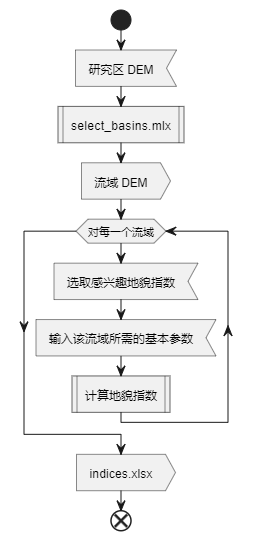

## 一、项目概述

本开源函数集基于 TopoToolbox 开发，致力于为构造地貌研究领域提供一套简单且高效的工具。它主要用于面向多流域，计算多种关键的地貌指数，如面积高程积分（HI-Hypsometric Integral）、流域不对称度（AF-Asymmetry Factor）、盆地形状指数（BS-Basin Shape）、谷底宽高比（VF-Valley Floor）、标准化河流梯度指数（SL/K-Standardized Stream-Length）、伸长比（Re-Elongation Ration）面积高程曲线（HC-Hypsometric curve）。该函数集能够解决地貌研究中数据量化分析较复杂、多指数综合评估复杂以及可视化呈现不足等问题。

## 二、函数列表与功能描述

注意以下的数据都是面向完整流域的，输入数据一般为TIFF格式的DEM。

### 1. 面积高程积分（HI, Hypsometric Integral）函数
- 函数名：`ttb_calculate_hi_index`
- 输入参数：
	- `dem` - TopoToolBox 的 GRIDobj 类型，表示流域的高程数据。
- 返回值：一个浮点数值，表示计算得到的面积高程积分（HI）结果，取值范围通常在 0 到 1 之间，该值反映了区域的地貌发育阶段等特征。
- 函数实现的功能：通过对给定流域范围内的高程数据进行统计分析，按照面积高程积分的计算公式，计算出该流域的 HI 值，以此来衡量地形相对高差与整体面积之间的关系，HI值越大，便表明该地貌经历强烈的构造变形阶段，处于地貌发育初始阶段；反之HI值越小，表示现今地貌经历构造变形弱或者未经历构造变形，处于地貌发育晚期阶段。

### 2. 伸长比（Re, Elongation ratio）函数
- 函数名：`ttb_calculate_re_index`
- 输入参数：
	- `dem` - TopoToolBox 的 GRIDobj 类型，表示流域的高程数据。
	- `main_stream` - TopoToolBox 的 STREAMobj 类型，表示流域的干流。
- 返回值：一个浮点数值，即计算得出的伸长比（Re）结果，Re 值通常为 0 至 1，其值反映了流域在空间上的伸展程度。
- 函数实现的功能：依据输入的流域形状和面积信息，按照伸长比的计算原理，衡量流域在某一方向上相对拉长的形态特征，有助于对比不同流域形态以及分析地貌形成过程中受到的构造、水流等因素影响。

### 3. 流域不对称性（AF, Asymmetry Factor）函数
- 函数名：`ttb_calculate_af_index`
- 输入参数：
	- `dem` - TopoToolBox 的 GRIDobj 类型，表示流域的高程数据。
	- `main_stream` - TopoToolBox 的 STREAMobj 类型，表示流域的干流。
	- `show` - bool 类型，表示是否显示计算过程中的可视化效果。
- 返回值：一个浮点数值，表示流域不对称性（AF）的值，该值可体现流域两侧水流及侵蚀情况的不均衡性。
- 函数实现的功能：根据输入的河流网络和流域中心坐标，分析河流在流域内的分布特征，计算出 AF 值，以此判断流域受到的外力作用、水流方向偏好以及左右两侧地貌发育差异等情况。

### 4. 流域形状指数（BS）函数
- 函数名：`ttb_calculate_bs_index`
- 输入参数：
	- `dem` - TopoToolBox 的 GRIDobj 类型，表示流域的高程数据。
	- `main_stream` - TopoToolBox 的 STREAMobj 类型，表示流域的干流。
	- `show` - bool 类型，表示是否显示计算过程中的可视化效果。
- 返回值：一个浮点数值，即计算得到的流域形状指数（BS）结果，用于表征流域整体的几何形状特点。
- 函数实现的功能：依据输入的流域周长和面积，按照流域形状指数的定义公式进行计算，通过 BS 值来区分不同形状（如圆形、狭长形等）的流域，进而辅助分析地貌形成的相关影响因素以及不同流域之间的形态差异。

### 5. 标准化河流梯度指数（SLK, Standardized stream-length gradient index）
- 函数名：`ttb_calculate_slk_index`
- 输入参数：
	- `dem` - TopoToolBox 的 GRIDobj 类型，表示流域的高程数据。
	- `main_stream` - TopoToolBox 的 STREAMobj 类型，表示流域的干流。
- 返回值：一个浮点数值，代表标准化河流梯度指数（SLK）的计算结果，可反映河流坡度在整个流域内的相对变化情况。
- 函数实现的功能：综合考虑河流长度、高程以及流域面积等信息，按照 SLK 的计算方法进行运算，通过 SLK 值来揭示河流系统在流域内的发育特征、水流侵蚀能力以及地形变化趋势等，为研究河流地貌演变提供量化指标。

### 6. 谷底宽高比（VF, Valley Floor Width-to-Height Ratio）
- 函数名：`ttb_calculate_bs_index`
- 输入参数：
	- `dem` - TopoToolBox 的 GRIDobj 类型，表示流域的高程数据。
	- `main_stream` - TopoToolBox 的 STREAMobj 类型，表示流域的干流。
	- `V_fw_min` - 谷底宽度最小值
	- `V_fw_max` - 谷底宽度最大值
	- `interval_num` - 计算间隔数量
	- `show` - bool 类型，表示是否显示计算过程中的可视化效果。
- 返回值：一个浮点数值，表示谷底宽高比（VF）的计算结果，该值用于刻画谷底形态特征。
- 函数实现的功能：基于输入的谷底宽度和谷侧高度信息，按照 VF 的计算规则算出比值，通过谷底宽高比来分析河谷的发育程度、水流作用强度以及不同区域谷底形态的差异等情况。

### 7. Iat 指数

Iat 是一个综合指标，用于对流域的地貌特征进行综合评价。它是根据多个地貌指数的计算结果综合得出的一个分数，反映了流域的整体特征。
可参考：
孙林龙, 董有浦, 吴中海, 张世涛, 李立, 刘志明, 2024. 基于河流地貌指数的澜沧江断裂南段构造活动性研究. 地质科学 59, 1543–1561. https://doi.org/10.12017/dzkx.2024.107

## 三、安装与使用

该函数集依赖于 TopoToolbox 库

### 使用说明

`select_basins.mlx` 为预处理脚本， `GeomorphicIndicesExtractApp.mlapp` 为程序入口，`assets\test\`为测试数据。

本程序的工作流如下：

#### 预处理

本函数集可以面向研究区的 DEM，借助 TopoToolBox 对研究区的 DEM 数据开展流域分析。随后在可视化窗口中点选我们感兴趣的流域，得到其流域的 DEM 数据，并按照指定的输出格式输出计算结果。

具体来说，您需要打开 `select_basin.mlx` 脚本，按照注释说明，设置好研究区 DEM 的路径以及想要输出的工作空间路径，然后运行脚本，点击选取您感兴趣的流域，按 `Entry` 键结束获取，输出您所感兴趣的流域的 DEM 数据。

#### 计算指数

打开 GeomorphicIndicesExtractApp.mlapp，选择预处理阶段输出的工作空间所在的文件夹作为输入工作空间，选择您想要输出的文件夹作为输出工作空间，选择需要计算的若干地貌指数，点击“Run”按钮。

对于每一个流域，您都需要单独输入流域启动河流所需的最小上游区域（单位为像素）个数。
> caution: 请确保输入的最小上游区域个数合理，否则会导致计算结果不准确。

如果您勾选了 `HC` 选项，在计算过程中会生成另一个 HC 的 figure 窗口，该窗口显示了流域的面积高程曲线。同时，我们需要您输入过程中采样的个数。在计算结束后，在输出工作空间目录下同时会生成一个 `HC.png` 图片文件。

#### 结果展示

计算结束后，会在 app.Figure 窗口中显示计算结果的表格。

结果主要以 `.xlsx` 格式输出，包含计算的各个指数的结果。此外若您勾选了 `HC` 选项，则会在输出工作空间中输出一个 `HC.png` 结果，该结果为流域的面积高程曲线，可用于可视化展示。

此外，该程序还会生成拼接了所有流域且加入了您感兴趣的所有地貌指数的 shapefile 文件，可用于地理信息系统的可视化展示。

此外，除了使用我们封装好的 app，你也可以直接调用函数进行计算。

## 四、联系我们

开发人员：戴钊龙，沈言根，李安波
（我们鼓励并欢迎其他地貌开发人员对项目进行补充！！！）

如果使用该程序遇到问题需要反馈，可通过邮件方式联系yangen_shen@163.com、zorion.dai@gmail.com。

如果你使用了这个程序，请引用：  
[1] Dai, Z., Shen, Y., & Li, A. (2024). Automatic extraction of the geomorphic indices (1.0). Zenodo. https://doi.org/10.5281/zenodo.14547642  
[2] Schwanghart, W., Kuhn, N.J., 2010. TopoToolbox: A set of Matlab functions for topographic analysis. Environmental Modelling & Software 25.  
[3] Schwanghart, W., Scherler, D., 2014. Short Communication: TopoToolbox 2 – MATLAB-based software for topographic analysis and modeling in Earth surface sciences. Earth Surface Dynamics 2, 1–7.  

（正在更新）
